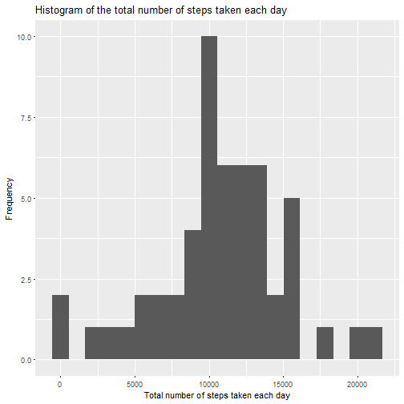
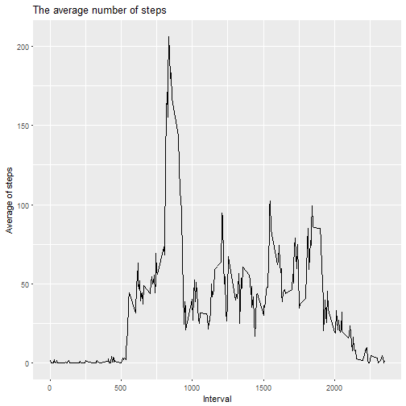
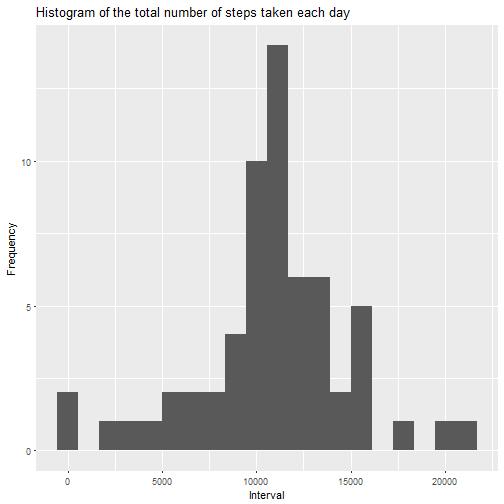
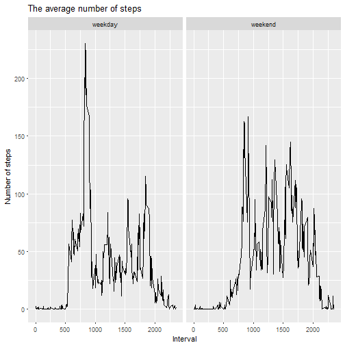

###Loading and preprocessing the data


```r
data<-read.csv("activity.csv", header = TRUE)
data$date <-as.Date(data$date, format = "%Y-%m-%d")
```

**Calculate the total number of steps taken per day**


```r
totals<-aggregate(steps~date,data = data, sum)
```

**The first rows of total number tables :**


```r
library(knitr)
tbl<- kable(head(totals))
print(tbl)
```


|date       | steps|
|:----------|-----:|
|2012-10-02 |   126|
|2012-10-03 | 11352|
|2012-10-04 | 12116|
|2012-10-05 | 13294|
|2012-10-06 | 15420|
|2012-10-07 | 11015|

**Histogram of the total number of steps taken each day**


```r
if (!"ggplot2" %in% installed.packages()) {
  install.packages("ggplot2")
}
library(ggplot2)
qplot(totals$steps, 
      xlab = "Total number of steps taken each day", 
      main = "Histogram of the total number of steps taken each day", 
      ylab = "Frequency", 
      bins =20)
```



**Mean and median number of steps taken each day**


```r
m<- format(mean(totals$steps), nsmall = 2)
md<-format(median(totals$steps), nsmall = 2)
```

Mean = **10766.19**, median = **10765**


**Time series plot of the average number of steps taken**


```r
stepsByInterval<- aggregate(steps ~interval, data = data,mean)
qplot(x=stepsByInterval$interval, 
      y= stepsByInterval$steps, 
      xlab = "Interval", 
      ylab = "Average of steps", 
      geom= "line", 
      main = "The average number of steps")
```




**The 5-minute interval that, on average, contains the maximum number of steps**


```r
mx <-stepsByInterval[which.max(stepsByInterval$steps),]
```

Interval = **835**, maximum = **206.1698**

##Imputing missing values

Calculate and report the total number of missing values in the dataset (i.e. the total number of rows with NAs)


```r
countMisVal <-nrow(data[is.na(data$steps),])
```

The total number of missing values is **2304**

Filling in all of the missing values in the dataset. The missing value is mean for given interval.


```r
newValue<-function(i)
{
  ifelse(is.na(data[i,]$steps), 
           stepsByInterval[stepsByInterval$interval== data[i,]$interval,]$steps ,
           data[i,]$steps )
}
newdata <- data.frame(date = data$date, interval= data$interval,steps = sapply(1:nrow(data), FUN= newValue))
```

**Histogram of the total number of steps taken each day**


```r
totals<-aggregate(steps~date,data = newdata, sum)
qplot(x=totals$steps, 
      xlab = "Interval", 
      ylab = "Frequency", bins =20,
      main = "Histogram of the total number of steps taken each day")
```



**Mean and median number of steps taken each day for new dataset**


```r
m<- format(mean(totals$steps), nsmall = 2)
md<-format(median(totals$steps), nsmall = 2)
```

Mean = **10766.19**, median = **10766.19**


##The average daily activity pattern

Create a new factor variable in the dataset with two levels - "weekday" and "weekend" indicating whether a given date is a weekday or weekend day.


```r
newdata$week <- ifelse(weekdays(newdata$date) %in% c("Saturday", "Sunday"), "weekend", "weekday")
```

**Panel plot comparing the average number of steps taken per 5-minute interval across weekdays and weekends**


```r
stepsByInterval<- aggregate(steps ~interval + week, data = newdata,mean)

ggplot(stepsByInterval, 
       aes(interval, steps)) + 
      geom_line() + 
      facet_grid(~ week) +
      xlab ( "Interval")+
      ylab("Number of steps")+
      ggtitle("The average number of steps")
```


